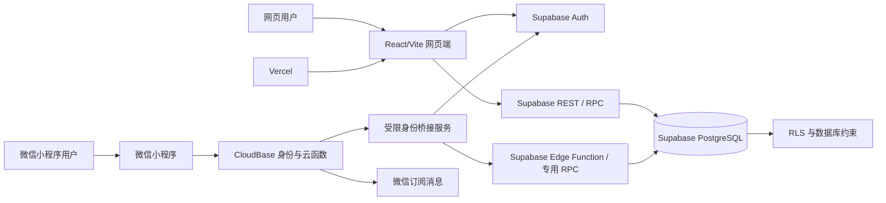

# 运维协同看板第一版建设方案（Web 与微信小程序双端版）

> 文档定位：本文件是项目的产品总纲、双端技术方案和分阶段开发路线图。  
> 首要目标：在尽量节省 Codex 额度的前提下，先完成网页端核心运维协同闭环；核心闭环封板后优先建立受控试运行环境并用真实低风险项目验证，再根据试运行反馈建设网页工作台和后续增强，最后以同一账号体系和同一业务数据库上线微信小程序端。  
> 版本：V1.3  
> 日期：2026-08-10  
> 代码仓库：`https://github.com/lwd619783-byte/ops-collaboration-dashboard`  
> 开发模式：公开仓库、功能分支开发、GitHub Actions 门禁、远端独立代码审计、审查通过后 PR 合并


---

## 0. 文档使用规则与强制优先级

本方案既是产品建设路线图，也是后续所有 Codex 开发任务、代码审计、Pull Request 和上线操作的最高级项目约束。

### 0.1 约束优先级

发生冲突时，按以下顺序处理：

1. 用户在当前任务中的明确指令；
2. 本方案中的安全红线、权限边界和公开仓库规则；
3. 仓库根目录 `AGENTS.md`；
4. 当前任务提示词中的范围与验收标准；
5. README、代码注释和其他工程约定。

任何 Codex 任务都不得以“提高开发效率”为理由绕过更高优先级约束。

### 0.2 每次任务开始前必须读取的内容

Codex 在修改代码前必须读取并核对：

- 本建设方案最新版本；
- 根目录 `AGENTS.md`；
- 根目录 `README.md`；
- `package.json`、锁文件和现有脚本；
- 与本任务直接相关的数据模型、迁移、权限策略和测试；
- 当前 `main`、功能分支、远端和工作树状态；
- GitHub 上当前功能分支相对 `main` 的真实基线。

### 0.3 每次任务结束前必须完成的事情

除非任务明确另有规定，Codex 必须：

- 运行项目统一检查命令；
- 运行与本任务相关的专项测试；
- 检查 `git diff --check`；
- 检查是否误提交密钥、真实业务数据、构建产物和本机文件；
- 在独立功能分支提交；
- 普通推送同名远端功能分支；
- 不创建 PR、不合并 `main`、不强推；
- 输出提交哈希、远端状态、测试证据、风险和未完成项。

### 0.4 独立审计才是通过依据

Codex 的完成报告和 CI 成功只能作为证据，不能代替代码审查。

一个开发任务只有在以下条件全部满足后，才可视为审查通过：

1. 功能分支已推送至公开 GitHub 仓库；
2. GitHub Actions 在准确提交上成功运行；
3. 独立审计者直接读取远端仓库代码；
4. 审计者检查 `main...功能分支` 的真实差异；
5. 审计者检查关键文件、测试、配置、安全和越界情况；
6. 如发现问题，Codex 在同一功能分支完成修复并再次推送；
7. 独立复核确认问题全部关闭；
8. 之后才进入 PR、Squash 合并和下一个任务。

任何“仅根据 Codex 自述报告给出最终通过”的结论都不属于正式封板。

---

## 1. 项目背景

当前需要建设一个能够部署在互联网、供内部团队和部分外部协作人员使用的轻量工作看板，并最终提供两种正式使用入口：

- **网页端**：承担项目创建、成员管理、任务分派、管理者工作台、复杂筛选和系统设置等完整能力；
- **微信小程序端**：承担移动查看、更新进展、上报阻塞、提交验收、处理待办和接收微信提醒等高频轻量能力。

系统不直接执行运维操作，也不替代专业工单平台、监控平台、在线文档或即时通信工具。它主要承担以下职责：

1. 将一件“大事”组织成项目；
2. 将项目拆分为工作模块和具体任务；
3. 明确每项任务由谁牵头、谁执行、谁协作、谁验收；
4. 持续记录每日进展、问题、阻塞和完成结果；
5. 为项目负责人、普通成员和上级管理者提供不同视角；
6. 在网页端和微信小程序端共享同一份实时业务数据；
7. 通过站内提醒、微信订阅消息和后续飞书通知主动触达成员；
8. 保存个人待办、工作记录和灵感。

长期来看，本系统可以同时支持：

- 运维项目；
- 文件起草；
- 标准编制；
- 专项保障；
- 调研任务；
- 会议筹备；
- 其他跨单位协作事项。

第一阶段仍然不追求一次性覆盖全部场景，而是按“共享后端与统一身份先行、网页完整闭环优先、小程序移动闭环随后”的顺序交付。

双端必须遵守以下底线：

- 业务数据只有一个权威来源，不为小程序另建一套项目和任务数据库；
- 同一个自然人在网页端和小程序端对应同一个系统用户；
- 项目、任务、权限、进展、验收和日志在双端保持一致；
- 微信身份只是一种登录身份，不能直接成为业务表主键。

## 2. 第一版产品目标

### 2.1 双端总体目标

完整路线必须让团队完成以下工作流程：

1. 用户通过网页账号或已绑定的微信身份安全进入系统；
2. 管理员在网页端创建运维项目；
3. 为项目指定牵头人和成员；
4. 牵头人将项目拆分为工作模块；
5. 牵头人创建任务并指定执行人、协作人、截止时间和验收人；
6. 普通成员在网页端或小程序端查看有权限的任务；
7. 普通成员在任一端更新任务状态、每日进展和阻塞信息；
8. 成员在完成任务后提交验收；
9. 项目牵头人通过或退回任务；
10. 管理者在网页端查看项目进度、逾期、阻塞和待决策事项；
11. 用户在小程序中查看个人重点任务和待处理事项；
12. 关键业务动作生成站内提醒，并在用户授权后发送微信订阅消息；
13. 所有关键修改保留操作记录；
14. 网页端和小程序端使用同一内部用户、同一业务数据和同一权限规则；
15. 系统能够稳定部署到互联网，网页端和微信小程序均可持续访问。

### 2.2 分阶段产品定义

#### `Operations Web Trial 0.9`

完成网页端安全登录、工作空间、项目、模块、任务、进展、阻塞和验收核心闭环，并完成独立的试运行 Supabase / Vercel 环境、迁移部署、真实账号烟雾测试、核心 E2E、备份/回滚说明和试运行问题收集机制。该版本允许 3–5 名内部成员在 1–2 个真实低风险项目中受控试运行，不要求“我的任务”、管理者工作台、提醒、日志、小程序等增强能力全部完成。

#### `Operations Web MVP 1.0`

在 `Operations Web Trial 0.9` 的真实使用证据上继续完成网页工作台、异常视图、团队负荷和经过验证的高优先级体验修复。提醒、日志和更完整的生产级运维能力继续按后续阶段建设。真实试运行不再以阶段 4 全部完成为前置条件。

#### `Operations Mini Program MVP 1.0`

完成微信登录与账号绑定、我的任务、任务详情、进展更新、阻塞上报、提交验收、待验收处理、消息中心和订阅消息。

#### `Operations Dual-Client MVP 1.0`

网页端和小程序端均通过双端安全审计，同一用户可在两个入口连续工作，数据和权限无分叉，形成正式双端版本。

### 2.3 成功标准

双端版本完成后，应满足：

- 团队可以连续使用系统管理一个真实运维项目；
- 日常协作不再依赖口头询问“谁在做、做到哪里、什么时候完成”；
- 牵头人不需要通过多个聊天群手工汇总任务状态；
- 管理者可以在网页端集中查看所有有权限项目的异常事项；
- 普通成员可以在小程序端完成高频执行动作；
- 用户从网页端切换到小程序端后看到的是同一任务和同一进度；
- 微信登录不会生成无法识别的重复成员；
- 普通成员不能查看未授权项目；
- 个人私密内容不会被其他用户读取；
- 删除、改派、延期、验收、账号绑定等关键行为可以追溯；
- 核心功能具备自动化测试并能稳定部署。

### 2.4 第一阶段明确不做的内容

为控制范围和 Codex 消耗，第一阶段暂不开发：

- 在线 Word 式文档编辑器；
- 完整即时聊天系统；
- 复杂甘特图和资源排期算法；
- 薪酬、绩效考核和人员评价；
- 自动连接服务器或执行运维命令；
- 复杂低代码审批引擎；
- 视频会议；
- 大规模知识库；
- 多租户商业化计费；
- AI 自动分配任务；
- 在飞书卡片内完成全部业务操作；
- iOS、Android 原生 App；
- 网页端与小程序端所有页面像素级一致；
- 小程序端承担复杂成员管理、批量项目配置和高级报表；
- 文件起草和标准编制的专用复杂功能。

## 3. 产品边界和基本原则

### 3.1 产品定位

> 这是一个面向小型团队和跨单位协作的轻量项目工作台。它以项目为管理对象，以模块和任务为执行单元，以牵头人负责制为核心管理方式，以每日进展、阻塞、验收和提醒为主要协作手段，并通过网页端与微信小程序端提供完整管理入口和移动执行入口。

### 3.2 设计原则

#### 原则一：先形成闭环，再增加功能

任何新模块都必须优先回答：它是否帮助完成“布置—执行—更新—验收—复盘”的闭环。

#### 原则二：单一业务数据源

Supabase PostgreSQL 继续作为项目、成员、模块、任务、进展、验收、提醒和日志的唯一权威数据源。CloudBase 不复制业务主数据，不建立第二套任务系统。

#### 原则三：系统用户与登录身份分离

系统内部用户使用稳定的 `app_user_id`。邮箱账号、Supabase Auth 用户、微信小程序 OpenID、未来企业微信身份都只是该用户的外部登录身份。

#### 原则四：网页完整、小程序聚焦

网页端承担完整管理和复杂操作；小程序端优先覆盖成员每天最常用的查看、更新、阻塞、验收和提醒。双端共享业务规则，但不强求复用同一套 UI。

#### 原则五：项目内透明，项目间隔离

同一项目内，普通成员原则上可以查看其他成员的普通任务和进度；不同项目之间必须严格隔离。

#### 原则六：私密内容默认不共享

个人待办、私人日志、灵感记录默认仅本人可见。任何共享都必须由用户主动选择。

#### 原则七：后端权限是真正的权限边界

前端隐藏按钮不等于安全。网页端、小程序端、CloudBase 云函数和任何 HTTP 调用都必须经过数据库或可信服务端授权。

#### 原则八：微信身份服务不拥有业务超级权限

小程序前端不得包含 Supabase `service_role`、数据库密码、微信 AppSecret、CloudBase 服务端密钥或任何可绕过 RLS 的凭据。CloudBase 仅执行经过白名单约束的身份校验、身份桥接和微信生态动作。

#### 原则九：重大事项上收，普通事项下放

普通任务由项目牵头人验收；项目里程碑、重大延期和重大风险后续再上报管理者审批。

#### 原则十：先网页试运行，再双端正式上线

网页端核心闭环完成后先管理一个真实项目；小程序在共享业务模型稳定后接入。最终正式双端上线必须通过账号绑定、权限一致性、隐私和发布审计。

### 3.3 公开仓库、私有数据与私有密钥

本项目采用公开 GitHub 仓库进行源代码开发和独立审计，但“公开代码”不等于“公开业务数据”。

长期边界如下：

- 可公开：通用前端代码、小程序通用代码、通用数据库迁移、RLS 策略、通用测试、虚构示例、CI 配置和技术文档；
- 不可公开：生产业务数据、实际项目内容、真实人员和单位信息、OpenID、UnionID、手机号、日志、IP、域名、网络拓扑、账号、密码、Token、Cookie、私钥和第三方服务密钥；
- 生产秘密只允许保存在 Vercel、Supabase、CloudBase、微信公众平台、GitHub Secrets 或其他受控的服务端密钥系统；
- 微信 AppSecret、会话密钥和 CloudBase 服务端凭据只能在可信服务端使用；
- 生产业务数据只允许保存在经过权限控制、备份和审计的数据库或对象存储中；
- 系统安全必须依靠认证、服务端授权和数据库 RLS，不能依赖源码不可见；
- 公开仓库暂不自动等于开源项目，未经单独决策不添加开放许可证。

### 3.4 公开开发的基本后果

仓库公开后，当前文件、可达提交历史、功能分支、Pull Request、Actions 日志、Issue、测试样例、数据库迁移、小程序配置示例和文档都应按“任何人可以看到”处理。

任何敏感内容一旦进入远端，不能把“后续删除文件”当作充分补救措施。

## 4. 用户角色与权限设计

### 4.1 工作空间级角色

| 角色 | 主要权限 |
|---|---|
| 工作空间所有者 | 管理全部项目、成员、权限和系统配置；查看全局数据 |
| 工作空间管理员 | 创建项目、管理成员、查看工作空间内非私密内容 |
| 普通成员 | 只能进入自己加入的项目；管理自己有权限的任务 |
| 外部协作者 | 只能进入被邀请的项目和被授权的内容 |

第一版可以由同一个人兼任“工作空间所有者”和“管理员”。

### 4.2 项目级角色

| 角色 | 主要权限 |
|---|---|
| 项目发起人 | 创建项目、任命牵头人、查看项目全貌、归档项目 |
| 项目牵头人 | 管理模块、分配任务、调整计划、验收任务、处理一般阻塞 |
| 模块负责人 | 管理指定模块及其任务，可对模块内任务进行分派和验收 |
| 项目成员 | 查看项目内允许查看的任务，更新自己负责的任务 |
| 外部协作者 | 仅访问被授权模块、任务和文件 |
| 观察者 | 只读查看，不可修改 |

第一版为节省开发量，可以先实现四类项目角色：

- `owner`：项目发起人；
- `lead`：项目牵头人；
- `member`：普通成员；
- `viewer`：只读观察者。

“模块负责人”和“外部协作者”的精细权限放到后续增强阶段。

### 4.3 内容可见范围

任务和记录应支持以下可见范围：

- `private`：仅创建者可见；
- `specified`：仅指定用户可见；
- `project`：项目成员可见；
- `workspace`：工作空间成员可见。

第一版建议：

- 项目任务默认使用 `project`；
- 个人待办、私人日志和灵感默认使用 `private`；
- 敏感任务可以使用 `specified`；
- `workspace` 可暂时保留数据字段，但不急于在界面中开放。

### 4.4 普通成员的任务可见性

同一项目内，普通成员默认可以查看：

- 任务标题；
- 负责人和协作人；
- 状态；
- 优先级；
- 截止时间；
- 当前进度；
- 非私密的每日进展；
- 是否阻塞；
- 预计工作量。

普通成员默认不能：

- 修改他人任务；
- 更改他人负责人；
- 删除他人任务；
- 访问指定人员可见的敏感任务；
- 查看他人的私人待办、日志和灵感。

---

## 5. 核心业务模型

### 5.1 身份与业务层级

```text
自然人
  └─ 系统内部用户 app_users
      ├─ 公开资料 profiles
      ├─ 登录身份 user_identities
      │   ├─ supabase_auth / email
      │   ├─ wechat_miniprogram
      │   └─ enterprise_wechat（后续）
      └─ 工作空间成员身份
          └─ 项目
              ├─ 项目成员
              ├─ 工作模块
              │   └─ 任务
              │       ├─ 负责人
              │       ├─ 协作人
              │       ├─ 每日进展
              │       ├─ 验收记录
              │       ├─ 提醒
              │       └─ 操作记录
              └─ 项目风险与里程碑（后续阶段）
```

所有业务外键均指向内部 `app_users.id`，不直接指向 OpenID、UnionID、邮箱或某个客户端的临时会话。

### 5.2 身份绑定规则

- 一个 `app_user` 可以绑定多个登录身份；
- 同一外部身份只能绑定一个 `app_user`；
- 微信身份唯一性至少包含身份提供方、微信应用标识和 OpenID；
- UnionID 仅在满足微信开放平台条件并经过验证后用于跨应用辅助关联，不能盲目信任客户端上报；
- 首次微信登录不得自动创建拥有业务权限的正式成员；
- 首次绑定优先通过管理员邀请、一次性绑定码或已登录网页账号确认；
- 绑定、解绑、合并和冲突处理必须进入审计日志；
- 禁止仅凭昵称、头像或相同手机号静默合并账号。

### 5.3 项目状态

- `planning`：筹备中；
- `active`：进行中；
- `paused`：暂停；
- `completed`：已完成；
- `archived`：已归档。

第一版项目状态流转：

```text
筹备中 → 进行中 → 已完成 → 已归档
             ↕
            暂停
```

### 5.4 任务状态

- `backlog`：待规划；
- `todo`：待开始；
- `in_progress`：进行中；
- `blocked`：已阻塞；
- `pending_review`：待验收；
- `completed`：已完成；
- `cancelled`：已取消。

推荐流转：

```text
待规划 → 待开始 → 进行中 → 待验收 → 已完成
                     ↓          ↑
                   已阻塞 ──────┘

任意未完成状态 → 已取消
待验收 → 退回后回到进行中
```

### 5.5 任务优先级

- `low`：低；
- `medium`：普通；
- `high`：高；
- `urgent`：紧急。

### 5.6 工作量字段

为避免只按任务数量判断人员负荷，每项任务至少包含：

- 预计工时，单位为小时；
- 工作量等级：轻量、一般、较重、重大；
- 实际工时，第一版可选填；
- 完成比例：0–100；
- 截止时间。

第一版的团队负荷只做简单汇总，不做自动排期算法。

## 6. 第一版功能范围

### 6.1 统一账号与登录身份

必须具备：

- 系统内部用户 `app_users`；
- 用户资料 `profiles`；
- 多登录身份表 `user_identities`；
- 网页端邮箱和密码登录；
- 退出、忘记密码、重置密码和登录状态保持；
- 未登录用户无法进入业务页面；
- 被停用用户不能继续访问；
- 微信小程序登录和现有账号绑定；
- 绑定冲突、解绑、重复身份和停用账号处理；
- 账号绑定与安全敏感操作日志。

第一版不开放任何人自由注册。建议采用：

- 管理员邀请或预先创建成员；
- 成员在网页端激活账号；
- 小程序首次登录时使用一次性绑定码、邀请确认或网页端确认完成绑定；
- 未完成绑定的微信用户不得读取真实业务数据。

### 6.2 工作空间与成员管理

必须具备：

- 创建默认工作空间；
- 查看成员列表；
- 邀请成员；
- 设置成员角色；
- 停用成员；
- 显示成员所属单位；
- 查看成员当前参与的项目。

工作空间和复杂成员管理优先放在网页端，小程序端首发只展示与当前用户相关的基础成员信息。

### 6.3 项目管理

必须具备：

- 创建和编辑项目；
- 设置名称、说明、类型、起止时间和状态；
- 指定项目牵头人；
- 添加和移除项目成员；
- 查看项目概览；
- 归档项目；
- 项目间权限隔离。

第一版项目类型先提供运维项目和通用项目。项目创建、成员配置和归档优先仅在网页端提供。

### 6.4 工作模块管理

必须具备：

- 在项目中创建模块；
- 编辑模块名称和说明；
- 设置模块排序；
- 将任务归入模块；
- 模块可暂时不设置独立权限。

运维项目可以预设：日常巡检、故障处理、安全整改、备份与恢复、变更实施、应急保障、文档与复盘。

### 6.5 任务管理

必须具备：

- 创建、编辑、复制和软删除任务；
- 指定模块、负责人、协作人和验收人；
- 设置优先级、开始日期、截止日期、预计工时、工作量等级；
- 设置状态、完成比例、任务说明和验收标准；
- 设置可见范围；
- 查看任务详情和历史记录。

任务创建和复杂配置以网页端为主；小程序端首发重点支持查看、执行和验收，不强制提供完整任务编辑器。

### 6.6 每日进展

成员可以在网页端或小程序端新增进展记录，字段包括：

- 今日完成内容；
- 当前完成比例；
- 遇到的问题；
- 下一步计划；
- 是否需要协助；
- 是否阻塞；
- 记录日期；
- 创建人和创建时间。

进展以追加为主，普通成员不能删除他人进展，标记阻塞必须填写原因，双端更新必须形成同一条时间线。

### 6.7 任务验收

成员完成任务后：

1. 填写完成说明；
2. 将任务提交到 `pending_review`；
3. 验收人收到站内待办；
4. 用户授权后可以收到微信订阅消息；
5. 验收人选择通过或退回；
6. 退回必须填写原因；
7. 通过后任务进入 `completed`；
8. 所有动作进入操作记录。

网页端与小程序端必须共享同一套幂等和权限规则，重复点击不能产生重复审批记录。

### 6.8 首页工作台

网页端提供管理者、项目牵头人和普通成员三种完整视图，包括项目红黄绿、逾期、阻塞、待验收、长期未更新、成员负荷和近期动态。

小程序端首发只提供个人工作台：今日任务、即将到期、已逾期、阻塞、待更新、被退回和待我验收。

### 6.9 看板、列表和筛选

网页端提供状态看板和表格列表，支持项目、模块、负责人、协作人、状态、优先级、截止时间、逾期、阻塞和待验收筛选。

小程序端首发使用卡片列表和有限筛选，不开发复杂表格、拖拽看板和高级批量操作。

### 6.10 个人空间

为不拖慢运维 MVP，个人空间只做最小版本：个人待办、灵感速记和私人工作日志，默认仅本人可见。完整个人空间可在双端 MVP 后增强。

### 6.11 站内提醒和微信提醒

共享提醒类型包括：新任务分配、改派、即将到期、逾期、提交验收、通过、退回、阻塞和被提及。

- 网页端和小程序端均可读取同一 `notifications` 数据；
- 提醒已读状态在双端同步；
- 微信订阅消息只是额外触达渠道，不是业务数据源；
- 发送微信消息必须基于用户授权、模板约束、幂等记录和失败重试边界。

### 6.12 操作日志与回收站

关键操作包括项目、成员、任务、状态、延期、改派、验收、权限、账号绑定和解绑。任务采用软删除并支持授权人员恢复。

### 6.13 微信小程序首发能力

小程序首发必须包含：

- 微信身份校验；
- 与现有系统用户绑定；
- 我的任务；
- 任务详情；
- 更新进展和完成比例；
- 标记或解除阻塞；
- 提交验收；
- 处理待我验收；
- 查看和标记提醒；
- 微信订阅消息授权与发送记录；
- 个人基础资料；
- 无权限、停用、登录失效和网络异常状态。

小程序首发暂不包含：

- 工作空间创建；
- 大规模成员管理；
- 项目创建和归档；
- 复杂任务批量编辑；
- 拖拽看板；
- 复杂报表和团队负荷分析；
- 完整个人空间；
- 飞书卡片交互。

## 7. 双端前端建设方案

### 7.1 网页端技术栈

继续使用现有 React、TypeScript 严格模式、Vite、Tailwind CSS、React Router、TanStack Query、React Hook Form、Zod、Supabase JavaScript SDK、Vitest、Testing Library，并在上线前增加关键 Playwright 流程。

网页端承担完整管理能力，不因为小程序计划而推翻 Task 0.2 已完成的设计系统和页面骨架。

### 7.2 微信小程序技术策略

小程序阶段默认优先：

- 微信小程序原生框架；
- TypeScript；
- 微信开发者工具；
- CloudBase 小程序 SDK 和云函数；
- 与网页端共享业务类型、状态机、校验规则和 API 契约；
- 不强行共享 React/Tailwind UI 组件。

在 Task 5.1 技术验证中可以评估 Taro 等跨端框架，但只有在构建、包体积、调试、微信能力和长期维护均明显受益时才允许切换。技术选择必须形成可回滚的独立决策，不得为了“代码复用”牺牲小程序稳定性。

### 7.3 仓库结构演进

Task 1 至 Task 4 继续保持现有网页端目录，避免现在进行无收益的大规模迁移。进入小程序阶段时再演进为：

```text
src/                         # 现有网页端
miniprogram/                 # 微信小程序端
packages/
  domain/                    # 状态枚举、领域类型、纯函数和状态机
  validation/                # 可跨端复用的 Zod 或等价校验
  api-contracts/             # 请求、响应和错误契约
cloudbase/
  functions/                 # 微信身份、订阅消息等服务端函数
supabase/
  migrations/
  tests/
```

只有在小程序构建工具真实需要时才引入 npm workspaces。不得为追求形式上的 monorepo 提前重构已稳定网页代码。

### 7.4 网页端页面

公共页面包括登录、忘记密码、重置密码、无权限和 404。登录后页面包括首页工作台、项目列表、项目详情、项目设置、任务详情、我的任务、团队负荷、消息中心、个人空间、成员管理和个人设置。

### 7.5 小程序页面

首发页面包括：

- 微信登录和账号绑定；
- 绑定冲突与待管理员处理；
- 个人工作台；
- 我的任务；
- 任务详情；
- 新增进展；
- 阻塞处理；
- 提交验收；
- 待我验收；
- 消息中心；
- 个人资料和设置；
- 无权限、停用和网络错误页。

### 7.6 双端交互要求

- 相同状态、优先级、日期和错误码使用同一业务语义；
- 双端不依赖颜色作为唯一状态标识；
- 任务和提醒需要稳定的实体 ID；
- 小程序消息点击后能够打开对应任务或待办；
- 任何写操作必须有进行中、防重复和失败反馈；
- 弱网和重复点击不能制造重复进展、重复验收或状态回退；
- 账号绑定属于高风险操作，必须明确展示当前绑定对象和结果；
- 网页端复杂表单不应机械压缩到小程序，移动端应采用分步或简化表单。

### 7.7 双端权限要求

前端权限只改善界面体验，不能替代后端授权。

- 网页端无权限用户不显示编辑入口；
- 小程序端不提供的管理能力不能仅靠“页面不存在”保证安全；
- 手工构造 HTTP 请求、云函数调用或 SDK 调用时，后端仍必须拒绝越权；
- 小程序包内不允许出现任何高权限密钥；
- CloudBase 云函数调用必须校验微信身份、请求来源、业务用户映射、权限和幂等。

## 8. 后端建设方案

## 8.1 推荐总体方案

采用“Supabase 核心业务后端 + Vercel 网页托管 + CloudBase 微信能力桥接”的架构：

- **Supabase PostgreSQL**：唯一业务数据源；
- **Supabase Auth**：网页端主要认证服务；
- **Supabase RLS、数据库函数和 Edge Functions**：核心权限和原子业务操作；
- **Vercel**：网页端部署；
- **CloudBase**：微信身份校验、云函数、订阅消息和后续微信生态能力；
- **微信小程序**：移动端交互入口，不保存权威业务数据。

第一版仍不维护一套通用 Node.js 常驻后端。CloudBase 和 Edge Functions 只承担必须在可信服务端执行的窄职责。

严禁为小程序另建一套 CloudBase 项目、任务和进展主数据库。

## 8.2 架构示意



小程序最终使用哪种 Supabase 会话签发或受限 API 模式，必须在 Task 5.1 通过官方能力验证、威胁建模和端到端原型后封板。任何方案都不得把 `service_role` 或 JWT 签名秘密下发到小程序。

## 8.3 后端职责划分

### 网页端可直接执行的操作

在 Supabase Auth 和 RLS 保护下，网页端可以通过 Supabase SDK 读取有权限的数据、新增进展、查看提醒、修改个人资料和执行经过授权的普通业务操作。

### 小程序端操作边界

小程序必须先完成微信身份校验和内部用户映射。首发默认通过受限身份桥接或专用服务端函数执行写操作；只有当 Task 5.1 证明能够安全获得受 RLS 保护的 Supabase 会话后，才允许小程序直接调用受控 Data API。

无论采用哪种模式：

- 小程序不得直接使用高权限凭据；
- CloudBase 不得充当无授权检查的通用数据库代理；
- 普通业务权限必须复用数据库策略、专用 RPC 或统一授权函数；
- 服务端不得信任客户端上报的 `user_id`、OpenID、角色或工作空间；
- 每个高风险操作必须有幂等键和审计记录。

### 必须通过数据库函数或可信服务端执行的操作

包括邀请用户、绑定或解绑微信身份、处理身份冲突、任命牵头人、提交和审批验收、改派任务、归档项目、批量提醒、微信订阅消息、飞书通知和高权限后台管理。

账号绑定相关函数必须比普通业务函数具有更严格的调用权限、重放防护和日志。

## 8.4 数据库设计原则

- 主键统一使用 UUID；
- 所有业务表包含 `created_at`、`updated_at`；
- 关键表包含 `created_by`、`updated_by`；
- 删除优先软删除，使用 `deleted_at`；
- 状态值使用数据库枚举或受控文本约束；
- 所有外键明确设置删除策略；
- 所有时间使用带时区时间戳；
- 数据库保存 UTC，前端按用户时区显示；
- 不能依赖前端传入的用户身份；
- RLS 默认拒绝，逐条开放合法访问；
- 高权限密钥绝不能放入前端环境变量。

## 8.5 核心数据表

### `app_users`

系统内部稳定用户，不绑定任何单一登录渠道。

核心字段：

- `id`；
- `status`：invited、active、suspended、merged；
- `created_at`；
- `updated_at`；
- `disabled_at`；
- `merged_into_user_id`，仅账号合并时使用。

### `user_identities`

登录身份与内部用户的映射。

核心字段：

- `id`；
- `user_id`，关联 `app_users.id`；
- `provider`：supabase_auth、wechat_miniprogram、enterprise_wechat 等；
- `provider_tenant`：Supabase 项目标识、微信 AppID 或其他身份域；
- `provider_subject`：外部稳定主体标识；
- `verified_at`；
- `last_used_at`；
- `created_at`；
- `revoked_at`。

唯一约束至少覆盖 `provider + provider_tenant + provider_subject`。敏感标识不得进入普通日志。

### `identity_binding_challenges`

用于一次性绑定码、网页确认和冲突处理。

核心字段：

- `id`；
- `target_user_id`；
- `provider`；
- `challenge_hash`；
- `expires_at`；
- `consumed_at`；
- `attempt_count`；
- `created_by`；
- `created_at`。

数据库只保存不可逆摘要，不保存可直接使用的一次性绑定码。

### `profiles`

用户公开资料，与认证身份解耦。

核心字段：

- `user_id`，对应 `app_users.id`；
- `display_name`；
- `avatar_url`；
- `organization_name`；
- `title`；
- `contact_info`，可选且需最小化；
- `created_at`；
- `updated_at`。

### `workspaces`

- `id`；
- `name`；
- `owner_id`；
- `created_at`；
- `updated_at`。

### `workspace_members`

- `workspace_id`；
- `user_id`；
- `role`；
- `status`；
- `joined_at`。

唯一约束：`workspace_id + user_id`。

### `projects`

- `id`；
- `workspace_id`；
- `name`；
- `description`；
- `project_type`；
- `status`；
- `owner_id`；
- `lead_id`；
- `start_date`；
- `due_date`；
- `created_by`；
- `created_at`；
- `updated_at`；
- `archived_at`。

### `project_members`

- `project_id`；
- `user_id`；
- `role`；
- `joined_at`。

唯一约束：`project_id + user_id`。

### `project_modules`

- `id`；
- `project_id`；
- `name`；
- `description`；
- `sort_order`；
- `created_by`；
- `created_at`；
- `updated_at`。

### `tasks`

- `id`；
- `project_id`；
- `module_id`；
- `title`；
- `description`；
- `acceptance_criteria`；
- `status`；
- `priority`；
- `visibility`；
- `assignee_id`；
- `reviewer_id`；
- `start_date`；
- `due_at`；
- `estimated_hours`；
- `effort_level`；
- `progress_percent`；
- `blocked_reason`；
- `submitted_at`；
- `completed_at`；
- `created_by`；
- `created_at`；
- `updated_at`；
- `deleted_at`。

### `task_collaborators`

- `task_id`；
- `user_id`；
- `added_at`。

### `task_visibility_users`

仅用于 `specified` 可见性。

- `task_id`；
- `user_id`。

### `task_checklist_items`

- `id`；
- `task_id`；
- `content`；
- `is_completed`；
- `sort_order`；
- `completed_by`；
- `completed_at`。

### `task_updates`

- `id`；
- `task_id`；
- `author_id`；
- `update_date`；
- `completed_work`；
- `progress_percent`；
- `issues`；
- `next_plan`；
- `needs_help`；
- `is_blocked`；
- `created_at`；
- `updated_at`。

### `task_reviews`

- `id`；
- `task_id`；
- `reviewer_id`；
- `action`：submitted、approved、rejected；
- `comment`；
- `created_at`。

### `notifications`

- `id`；
- `user_id`；
- `type`；
- `title`；
- `body`；
- `entity_type`；
- `entity_id`；
- `read_at`；
- `created_at`。

### `personal_items`

- `id`；
- `user_id`；
- `item_type`；
- `title`；
- `content`；
- `status`；
- `due_at`；
- `visibility`，第一版固定 private；
- `created_at`；
- `updated_at`；
- `deleted_at`。

### `audit_logs`

- `id`；
- `workspace_id`；
- `project_id`；
- `actor_id`；
- `action`；
- `entity_type`；
- `entity_id`；
- `before_data`；
- `after_data`；
- `created_at`。

第一版不必记录所有字段的每次变动，但关键权限、状态、负责人、截止时间和验收动作必须记录。

## 8.6 权限策略重点

至少保证：

1. 用户只能读取自己加入的工作空间；
2. 用户只能读取自己加入的项目；
3. 项目成员可以读取项目可见任务；
4. 指定可见任务仅创建者、负责人、协作人、验收人、指定用户和项目牵头人可读；
5. 私人内容仅本人可读写；
6. 普通成员只能更新自己负责或被授权协作的任务；
7. 普通成员不能自行将待验收任务改成已完成；
8. 只有验收人、项目牵头人或更高权限人员可以通过验收；
9. 只有管理者可以管理工作空间成员；
10. 停用用户不能继续读取业务数据。

RLS 策略应有专门测试，不允许只依赖人工验证。


## 8.7 统一身份解析

数据库应提供经过审计的身份解析边界，例如 `current_app_user_id()`，将可信认证上下文映射为内部 `app_user_id`。业务表和权限函数不得在各处重复解析邮箱、OpenID 或 JWT 字段。

要求：

- 网页 Supabase Auth 用户通过 `user_identities` 映射；
- 小程序身份通过已验证的微信身份和受限桥接流程映射；
- 未绑定、已撤销、已停用或冲突身份返回明确拒绝；
- 身份解析函数不得接受客户端直接传入的目标用户 ID；
- 权限测试覆盖网页身份、小程序身份、未绑定身份、停用身份和伪造身份。

## 8.8 CloudBase 职责边界

CloudBase 首发只负责：

- 接收并验证微信小程序登录上下文；
- 调用受限身份桥接；
- 发送微信订阅消息；
- 保存必要的消息发送元数据和运行日志；
- 后续承接微信文件上传、支付或企业微信能力时再单独审计。

CloudBase 首发不负责：

- 保存项目、任务、进展和验收权威副本；
- 使用管理员权限代理任意数据库查询；
- 在客户端返回微信 AppSecret、会话密钥或 Supabase 高权限密钥；
- 仅凭客户端 OpenID 决定用户身份；
- 绕过 Supabase RLS 和数据库约束。

---

## 9. 外部提醒与微信能力建设方案

### 9.1 站内提醒是权威记录

提醒首先写入 Supabase `notifications`。网页端和小程序端读取同一记录并同步已读状态。任何外部渠道发送失败都不能导致业务动作回滚或提醒记录丢失。

### 9.2 微信订阅消息

小程序核心闭环稳定后，通过 CloudBase 云函数发送：

- 新任务分配；
- 即将到期和逾期；
- 任务被退回；
- 待验收；
- 验收结果；
- 高优先级阻塞。

要求：

- 遵守微信订阅消息授权和模板规则；
- 不把用户一次授权理解为永久授权；
- 消息只包含必要信息，敏感详情进入小程序后查看；
- 每次发送保存业务幂等键、模板、接收用户、结果和错误分类；
- 点击消息必须先重新校验登录和任务权限。

### 9.3 飞书提醒

飞书不阻塞网页和小程序双端 MVP。双端稳定后再接入飞书企业自建应用，首发只提供“打开任务”按钮，不直接在卡片内修改业务数据。

### 9.4 外部渠道绑定数据

后续可在 `user_identities` 或专用渠道表中管理微信小程序、企业微信和飞书身份。通知渠道偏好、发送记录、重试、幂等键和回调记录必须与业务用户关联，不直接以昵称或手机号匹配。

## 10. 分阶段开发与上线顺序

### 总体优先级

| 优先级 | 阶段 | 目标 | 是否双端正式上线前必需 |
|---|---|---|---|
| P-1 | 公开开发安全门禁 | 审计历史、密钥、真实数据和日志 | 是 |
| P0 | 工程基线 | 建立可持续开发、测试和部署基础 | 是 |
| P0 | 统一身份模型 | 内部用户与登录身份解耦，避免双端重复账号 | 是 |
| P0 | 网页登录与工作空间权限 | 保证公网系统安全访问 | 是 |
| P0 | 项目与成员 | 能创建运维项目并组织团队 | 是 |
| P0 | 共享任务核心闭环 | 分派、更新、阻塞、验收 | 是 |
| P0 | 网页受控试运行准备与部署 | 独立远端环境、迁移、烟雾/E2E、回滚与问题池 | 是 |
| P0 | 网页工作台 | 基于试运行反馈提升成员和管理者效率，不作为进入试运行的前置条件 | 是 |
| P0 | 小程序身份桥接 | 安全完成微信登录和账号绑定 | 是 |
| P0 | 小程序移动闭环 | 查看、更新、阻塞、验收和提醒 | 是 |
| P0 | 双端上线加固 | 权限、隐私、备份、发布和回滚 | 是 |
| P1 | 微信订阅消息 | 主动触达移动用户 | 建议双端首发包含 |
| P1 | 站内提醒、日志和回收站 | 追踪和恢复 | 建议首发包含 |
| P1 | 个人空间 | 个人待办、日志和灵感 | 可在首发后补 |
| P1 | 飞书提醒 | 第三渠道主动触达 | 双端稳定后 |
| P1 | 运维增强 | 周期任务、风险、巡检模板 | 第二个业务版本 |
| P2 | 文件起草和标准编制 | 扩展项目类型 | 后续 |
| P2 | 统计与自动报告 | 周报、负荷趋势、复盘 | 数据积累后 |

### 上线顺序

1. 完成统一身份模型和网页登录；
2. 完成网页项目与任务核心闭环；
3. 完成阶段 3.9：建立与本地/生产隔离的网页受控试运行环境，完成迁移、部署、真实账号烟雾测试、核心 E2E、备份/回滚说明和试运行问题池；
4. 使用网页端由 3–5 名内部成员管理 1–2 个真实低风险项目，连续试运行 1–2 周；
5. 只优先修复 Blocker / Major，并依据真实反馈重新确认阶段 4 的优先级；
6. 完成阶段 4 网页工作台和试运行反馈增强，形成更完整的 `Operations Web MVP 1.0`；
7. 在已验证的稳定业务模型上完成微信身份桥接原型；
8. 上线小程序移动执行闭环；
9. 进行双端一致性、安全、隐私和发布审计；
10. 正式发布双端版本；
11. 再增加飞书、周期任务和其他项目类型。

## 11. Codex 分块开发任务清单

每一个任务都应在独立功能分支完成。一个任务只解决一个明确闭环，避免单次提示词过大。

## 阶段 0：工程基线

### Task 0.1：初始化项目仓库

当前状态：已完成远端独立审计、PR、CI 和 Squash 合并，作为稳定工程基线保留。

目标：建立最小可运行前端项目。

内容：

- React + TypeScript + Vite；
- Tailwind；
- 路由；
- 基础布局；
- ESLint、格式化和类型检查；
- Vitest；
- 环境变量示例；
- README；
- Git 忽略规则；
- 初始 CI。

验收：

- 本地可启动；
- 类型检查、测试和构建通过；
- 空白首页可部署到 Vercel；
- 不包含真实密钥。

### Task 0.2：建立设计系统和页面骨架

当前状态：已完成开发、响应式页面审计、远端独立审计、PR、CI 和 Squash 合并。后续网页功能继续复用该设计系统。

目标：统一后续页面开发方式。

内容：

- 页面布局；
- 左侧导航；
- 顶部栏；
- 手机端导航；
- 按钮、输入框、下拉框、弹窗、表格、徽章、空状态；
- 加载、错误、无权限组件；
- 日期和状态显示规范。

验收：

- 桌面端和手机端均无明显溢出；
- 常用组件有基础测试或展示页；
- 后续业务页面不重复造组件。

---

## 阶段 1：统一身份与权限底座

### Task 1.1：Supabase 项目接入和数据库迁移框架

当前状态：已完成远端独立审计、PR、CI 和 Squash 合并并封板。该任务不包含登录、业务表、远端生产 Supabase 和真实业务数据。

目标：建立数据库、迁移、类型生成、客户端连接、健康检查、凭据边界和数据库 CI。

### Task 1.2：统一系统用户与多身份数据模型

目标：在开发登录前建立双端不会返工的身份模型。

内容：

- `app_users`；
- `profiles`；
- `user_identities`；
- `identity_binding_challenges`；
- provider、tenant、subject 唯一约束；
- 邀请、激活、停用、合并和撤销状态；
- `current_app_user_id()` 或等价统一身份解析边界；
- 身份表 RLS、函数权限、pgTAP 和生成类型；
- 网页身份和未来微信身份测试夹具；
- 不接入真实微信 AppID、AppSecret 或 CloudBase 环境。

验收：

- 业务用户 ID 不等于 Supabase Auth ID 或 OpenID；
- 同一外部身份不能绑定多个用户；
- 未绑定身份没有业务权限；
- 停用用户和撤销身份被拒绝；
- 客户端不能通过传入任意 user_id 冒充他人；
- 数据库迁移、类型、权限和安全测试全部通过。

### Task 1.3：网页登录、资料和受保护路由

目标：用户可以通过网页安全登录，未登录用户不能访问业务页面。

内容：

- Supabase Auth 邮箱登录；
- 退出、忘记密码和重置密码；
- Auth 用户与 `app_users` / `user_identities` 映射；
- 受保护路由；
- 停用账号处理；
- 登录错误分类；
- 会话恢复和过期处理。

验收：

- 未登录访问业务 URL 时跳转登录页；
- 登录后返回原目标页面；
- 用户只能修改自己的资料；
- 停用或身份撤销后不能继续使用；
- 不直接把 `auth.uid()` 当成所有业务表用户主键。

### Task 1.4：工作空间和成员权限

目标：建立系统最上层组织边界。

内容：`workspaces`、`workspace_members`、默认工作空间、成员列表、角色设置、RLS 和最小邀请流程。

验收：非成员不能读取数据，普通成员不能管理成员，管理员可以停用成员，允许和拒绝场景均有测试。

---

## 阶段 2：项目与团队

### Task 2.1：项目 CRUD 和项目列表

目标：管理员可以创建、编辑和归档运维项目。项目创建后可进入详情页，归档项目不出现在默认列表，普通成员看不到未加入项目。

### Task 2.2：项目成员和牵头人

目标：为项目指定 owner、lead、member、viewer。移出项目后立即失去访问权，项目至少保留一名 owner 或 lead。

### Task 2.3：项目模块

目标：项目可拆分为多个工作模块，支持运维预设、增删改、排序和明确的删除策略。

---

## 阶段 3：共享任务核心闭环

### Task 3.1：任务数据模型和创建编辑

目标：牵头人可以创建完整任务，并以内部 `app_user_id` 关联负责人、协作人和验收人。

### Task 3.2：网页任务看板和列表

目标：网页端支持状态看板、表格列表、筛选、详情、深链接、逾期标识和响应式显示。首发不要求拖拽。

### Task 3.3：状态流转和阻塞

目标：建立受控状态机、阻塞原因、取消规则、历史记录、权限和幂等。

### Task 3.4：每日进展

目标：成员持续记录完成内容、比例、问题、下一步、协助和阻塞。进展模型必须能够被网页和小程序共同使用。

### Task 3.5：提交验收与退回

当前状态：已完成远端独立审计、PR #15、CI 和 Squash 合并，Task 3.1–3.5 的共享任务核心闭环已封板。

目标：通过原子数据库函数完成提交、通过、退回、恢复进行中、完成锁定和重复点击幂等。

完成阶段 3 后，业务核心闭环已经具备进入受控网页试运行的功能条件；但在使用真实业务数据前必须先完成阶段 3.9 的远端试运行环境、部署门禁、烟雾/E2E、备份/回滚和运行边界，不得把本地开发环境或未审计的生产环境直接当作试运行环境。

---

## 阶段 3.9：网页受控试运行准备与部署

阶段目标：不增加新的业务功能，在 Task 3.5 已封板的核心闭环上建立一个与本地开发、未来正式生产相隔离的可审计试运行环境，并证明真实成员能够安全完成一个完整任务工作流。

### Task 3.9.1：试运行部署基线与环境门禁

目标：让仓库具备可重复、可审计地部署到试运行环境的能力，而不是依赖个人临时操作。

内容：

- 定义 `local / trial(staging) / production` 环境边界和命名；
- 明确 Vercel 试运行环境与 Supabase 试运行项目的职责；
- 为前端环境变量、Supabase URL / publishable key、Edge Function 服务端密钥建立最小权限和校验规则；
- 保持浏览器端只允许公开的 Supabase URL 与 publishable key，不允许任何 `service_role`、数据库密码、JWT Secret 或其他高权限秘密进入 `VITE_*`；
- 建立可重复的远端 migration 部署、类型/迁移 drift 检查和部署后数据库验证流程；
- 建立 Edge Function 试运行部署与安全验证说明；
- 增加试运行部署 runbook、回滚 runbook、故障处置和环境核对清单；
- 明确 GitHub Actions、Vercel、Supabase 控制台日志中不得输出真实密钥、真实业务数据或敏感身份信息；
- 不在该任务中创建通知、工作台、小程序、CloudBase、飞书或其他 Stage 4+ 功能。

#### 本机操作者数据库凭据管理

- Trial / Recovery 数据库密码不得反复通过聊天、剪贴板或命令字面量传递；
- Windows 本机允许使用 CurrentUser + CurrentMachine DPAPI 加密保存数据库密码，真实 secret 只能位于仓库外；
- 仓库只保存不含真实凭据的通用初始化、加载、路由核对与清理 helper；
- Production 默认禁止自动加载数据库凭据，未知 target 必须 fail closed；
- credential ready 只表示当前进程连接上下文已准备，不代表 write、migration、PLAN 或 APPLY 获得授权；
- Recovery 官方 CA 与 TLS trust 属于 operator environment hardening，不能通过关闭 TLS verification 绕过；
- 凭据自动化不得执行或绕过 Recovery PLAN/APPLY、migration、部署、reset、restore 或其人工确认；
- 本机 config 只保存受控非密码元数据，Session Pooler linked-state 仍以当前 checkout 的 `supabase/.temp/` 为权威来源。

验收：

- 本地、试运行、未来生产三类环境边界明确；
- 仓库内没有真实密钥和真实业务数据；
- 试运行部署所需的所有非秘密配置、脚本、文档和检查可重复执行；
- 远端 migration / Edge Function 部署步骤有失败回滚和重新执行语义；
- 任何高权限密钥都只存在于受控服务端 Secret/环境管理系统；
- CI、类型、测试、数据库验证和生产构建全部通过；
- 功能分支通过远端独立审计后才可进入 PR 合并。

### Task 3.9.2：建立远端试运行环境并部署

目标：由已获授权的操作者建立独立 Supabase Trial/Staging 项目和 Vercel Trial/Staging 部署，并按 Task 3.9.1 的 runbook 完成真实部署。

要求：

- 试运行环境不得与未来正式生产环境共用数据库；
- 只使用平台 Secret 管理保存高权限凭据；
- 生产/试运行密钥不得进入仓库、聊天记录、PR、Issue 或 Actions 日志；
- 部署当前 `main` 的准确封板提交；
- 迁移、数据库验证、Edge Function 和前端部署均记录准确版本；
- 建立最小试运行管理员和测试成员时使用受控流程，不提交真实账号、邮箱和邀请链接；
- 未经额外合规确认，不导入高敏感机关数据、内部网络细节或其他不适合普通公网 SaaS 的内容。

### Task 3.9.3：真实账号 Smoke / E2E 与试运行准入

目标：用真实浏览器账号证明远端环境上的核心闭环可工作，并形成“允许试运行 / 阻断试运行”的明确结论。

至少验证：

1. owner/admin 登录与会话恢复；
2. 邀请/激活至少一个成员；
3. 创建项目、成员关系和工作模块；
4. 创建任务并设置负责人/验收人；
5. `todo -> in_progress`；
6. 新增每日进展并更新 progress；
7. `in_progress -> blocked -> in_progress`；
8. progress = 100 后提交验收；
9. 验收退回并回到 `in_progress`；
10. 再次提交并通过为 `completed`；
11. 未授权用户读取受限项目/任务被拒绝；
12. 已完成任务冻结语义正确；
13. 页面刷新、重新登录和深链接后状态一致；
14. 桌面浏览器和至少一个手机浏览器完成关键流程；
15. 数据库迁移版本、Edge Function 版本和网页部署版本可追溯；
16. 试运行问题池已经建立并按 Blocker / Major / Minor / Feature Request 分类。

准入规则：

- Blocker = 无法完成核心业务闭环、安全边界失效、数据丢失/污染、部署或回滚不可控：必须修复后才能试运行；
- Major = 严重影响真实使用、权限/状态/一致性存在明显风险：原则上试运行前关闭；
- Minor = 不阻断核心工作，可进入问题池；
- Feature Request = 新能力，不因试运行反馈立即扩大当前任务范围。

完成阶段 3.9 后形成 `Operations Web Trial 0.9`，建议由 3–5 名内部成员在 1–2 个真实低风险项目上连续使用 1–2 周。Stage 4 的真实优先级必须结合试运行证据重新确认。

---

## 阶段 4：网页工作台和试运行反馈增强

### Task 4.1：我的任务

目标：普通成员登录后看到今日、即将到期、逾期、阻塞、待更新、被退回和协作任务。

### Task 4.2：管理者工作台

目标：管理者快速发现项目红黄绿、逾期、阻塞、待验收、长期未更新和近期动态。

### Task 4.3：团队负荷概览

目标：按任务数、高优先级、预计剩余工时、到期和阻塞提供解释性负荷估算，不作为绩效评价。

完成阶段 4 后形成更完整的 `Operations Web MVP 1.0`。阶段 4 不再作为“能否开始试运行”的前置门槛，而应优先吸收 Stage 3.9 和真实试运行中确认的高价值需求；未被真实使用证明必要的复杂增强不得仅因旧路线图存在而自动开发。

---

## 阶段 5：微信小程序 MVP

### Task 5.1：微信身份桥接技术验证与威胁模型

目标：在写正式业务代码前证明微信身份能够安全映射到内部用户，并确定小程序访问 Supabase 的唯一生产方案。

内容：

- 创建独立开发用微信小程序和 CloudBase 环境；
- 验证微信登录身份获取；
- 设计 CloudBase 到 Supabase 的受限身份桥接；
- 对比“受 RLS 保护的 Supabase 会话”和“专用服务端 API”两种方案；
- 验证会话过期、重放、伪造、停用、解绑和冲突；
- 明确 AppSecret、CloudBase 密钥、桥接签名密钥和 Supabase 高权限密钥存放位置；
- 输出架构决策记录和回滚方案。

验收：

- 小程序包和公开仓库没有高权限密钥；
- 客户端无法伪造 OpenID 或 user_id；
- CloudBase 不能执行任意数据库管理员查询；
- 未绑定用户无法读取业务数据；
- 方案经过独立安全审计后才进入 Task 5.2。

### Task 5.2：小程序工程骨架和共享领域包

目标：建立可测试、可构建的小程序项目，复用业务类型、状态机、校验和错误契约，不重写业务规则。

内容：小程序路由、基础布局、导航、错误页、请求层、共享 domain/validation/api-contracts、CI、环境配置示例和开发文档。

### Task 5.3：微信登录和账号绑定

目标：微信用户通过管理员邀请、一次性绑定码或网页确认绑定到现有 `app_user`。

验收：首次登录不自动获得权限；重复绑定、过期挑战、暴力尝试、解绑、停用和合并冲突均被处理；绑定动作可追溯。

### Task 5.4：小程序个人工作台、我的任务和详情

目标：成员能在小程序查看今日、到期、逾期、阻塞、待更新、被退回和待我验收任务，并打开有权限的详情。

### Task 5.5：小程序进展、阻塞和验收闭环

目标：支持新增进展、更新比例、标记阻塞、解除阻塞、提交验收、通过和退回。所有写操作与网页端使用同一状态机、权限和幂等规则。

### Task 5.6：小程序消息中心和订阅消息

目标：读取共享站内提醒、同步已读状态，并在用户授权后通过 CloudBase 发送必要的微信订阅消息。

---

## 阶段 6：双端提醒、日志、安全和生产上线

### Task 6.1：站内提醒与双端一致性

目标：关键业务动作生成唯一提醒，网页和小程序已读状态一致，深链接正确且权限重新校验。

### Task 6.2：操作日志和任务回收站

目标：关键行为可追溯，误删可恢复，账号绑定和解绑也进入审计日志，日志不包含密钥和敏感会话信息。

### Task 6.3：双端安全和质量加固

内容：RLS 全面审计、身份桥接审计、CloudBase 函数权限、表单和数据库双层校验、防重复、日期时区、弱网、移动端、性能、无障碍、E2E、备份、隐私和敏感信息提示。

验收：

- 网页与小程序关键流程全部通过；
- 账号绑定、伪造身份、越权、重放和停用拒绝测试通过；
- 无高权限密钥进入浏览器包或小程序包；
- 双端数据状态一致；
- 备份和恢复流程经过验证。

### Task 6.4：双端生产部署与发布

内容：

- Vercel 网页生产环境；
- Supabase 生产项目；
- CloudBase 生产环境；
- 微信小程序 AppID、合法域名和环境配置；
- 数据库迁移和初始管理员；
- 小程序隐私指引、备案、审核材料和发布；
- 生产、预览、测试和本地环境隔离；
- 运行手册、监控、备份和回滚说明；
- 首个真实项目。

验收：网页和小程序均可访问，登录、绑定、权限、核心闭环和提醒正常，主分支部署稳定，数据库迁移和双端回滚方式明确。

此时形成 `Operations Dual-Client MVP 1.0`。

---

## 阶段 7：上线后的第一批增强

### Task 7.1：个人待办、日志和灵感

### Task 7.2：飞书机器人基础通知

### Task 7.3：周期任务

### Task 7.4：运维风险台账

### Task 7.5：附件和相关链接

### Task 7.6：项目周报

---

## 阶段 8：扩展到文件起草和标准编制

运维双端 MVP 稳定后，再增加文档版本、审签、会签、章节分工、专家意见、意见采纳、稿件阶段和评审节点，不重写共享项目、任务和身份系统。

## 12. 建议的首发范围

### 12.1 网页端首发

网页端首发包含：

1. 统一系统用户和网页登录；
2. 一个工作空间和成员管理；
3. 运维项目、项目成员和牵头人；
4. 工作模块；
5. 任务创建、分派、状态、阻塞和查看；
6. 每日进展；
7. 提交验收、通过和退回；
8. 我的任务；
9. 管理者异常工作台；
10. 基础站内提醒；
11. 操作日志和任务回收站；
12. 响应式网页、权限测试和互联网部署。

### 12.2 微信小程序首发

小程序首发包含：

1. 微信身份校验；
2. 与现有系统用户安全绑定；
3. 个人工作台和我的任务；
4. 任务详情；
5. 更新进展和完成比例；
6. 阻塞上报和解除；
7. 提交验收；
8. 待我验收、通过和退回；
9. 消息中心和已读同步；
10. 微信订阅消息；
11. 停用、无权限、会话失效和网络异常处理；
12. 隐私、备案、审核和正式发布。

### 12.3 双端首发暂不包含

- 飞书卡片内业务操作；
- 大规模附件；
- 周期任务；
- 风险台账；
- 完整个人空间；
- 文件起草和标准编制；
- 甘特图；
- 复杂报表；
- 小程序端复杂成员管理和项目配置；
- iOS、Android 原生 App。

## 13. 上线策略

### 13.1 网页内部试运行

完成阶段 3 和阶段 3.9 后即可进入网页受控试运行，不再等待阶段 4 全部完成。建议首轮使用 3–5 名内部成员、1–2 个真实低风险运维项目，连续使用 1–2 周。

试运行必须使用与本地开发和未来正式生产隔离的 Trial/Staging 环境；在没有单独完成数据分类分级与合规审查前，不得放入高敏感机关文件、内部网络细节、生产凭据或其他不适合普通公网 SaaS 承载的数据。

重点观察字段负担、更新意愿、验收流程、权限、统计口径、手机浏览器、页面入口、仍需在群里询问的信息，以及真实用户最常访问但当前缺失的聚合视图。

试运行问题统一进入问题池并按 `Blocker / Major / Minor / Feature Request` 分类。Blocker 与 Major 优先关闭；Minor 和 Feature Request 先记录，不因为单个反馈立即打断主线或扩大当前任务。

### 13.2 小程序双端试运行

小程序完成后，由同一批成员在网页和小程序间切换使用，重点检查：

- 是否生成重复账号；
- 绑定流程是否容易理解；
- 双端状态和已读提醒是否一致；
- 弱网和重复点击是否产生重复记录；
- 微信提醒是否过多或泄露敏感内容；
- 小程序是否真正减少群聊和电脑依赖；
- 管理员是否仍能通过网页完成完整控制。

### 13.3 正式上线门槛

只有在以下条件全部满足后才发布双端正式版本：

- 网页和小程序核心闭环通过；
- 身份桥接和账号绑定安全审计通过；
- 数据库权限、CloudBase 函数权限和密钥边界通过；
- 生产备份和恢复演练通过；
- 小程序隐私指引、备案和平台审核通过；
- 运行手册、监控、故障回滚和管理员责任明确。

### 13.4 反馈优先级

1. 数据泄露、身份错绑、权限错误和数据丢失；
2. 无法完成核心工作流程；
3. 双端数据不一致或重复写入；
4. 状态、统计或提醒错误；
5. 小程序或手机端严重不可用；
6. 明显影响效率的交互问题；
7. 新功能建议；
8. 视觉美化。

## 14. 测试方案

### 14.1 单元测试

覆盖状态流转、逾期、红黄绿、工作量、身份解析、权限辅助函数、日期时区、表单校验、账号绑定挑战和错误映射。

### 14.2 数据库与权限测试

覆盖：

- 非成员读取项目失败；
- 项目成员读取普通任务成功；
- 指定可见任务隔离；
- 普通成员改派失败；
- 非验收人审批失败；
- 私人内容隔离；
- 停用用户访问失败；
- 不同工作空间隔离；
- Supabase Auth 身份正确映射；
- 微信身份未绑定、撤销、冲突和伪造时被拒绝；
- CloudBase 服务端调用不能越过专用授权边界。

### 14.3 网页组件和页面测试

覆盖登录、任务创建、状态、进展、验收、筛选、空状态、错误状态和管理者工作台。

### 14.4 小程序测试

覆盖登录和绑定、我的任务、详情、进展、阻塞、提交验收、审批、提醒已读、订阅消息授权、会话失效、弱网、重试、重复点击和停用账号。

### 14.5 双端契约和一致性测试

- 双端使用相同状态枚举和错误码；
- 网页写入后小程序读取一致；
- 小程序写入后网页统计一致；
- 提醒已读同步；
- 同一幂等键不会重复写入；
- 时间、时区和完成比例语义一致；
- 账号只有一个内部用户 ID。

### 14.6 端到端测试

至少覆盖：

1. 网页创建项目、添加成员、模块和任务；
2. 成员网页登录、更新、提交、退回和再次通过；
3. 微信登录、绑定现有用户、查看同一任务、更新进展和提交验收；
4. 网页端牵头人处理小程序提交的验收；
5. 未加入项目用户从网页 URL 和小程序深链访问均被拒绝；
6. 停用用户在两个入口都失去权限；
7. 微信订阅消息点击后重新鉴权并打开正确实体。

### 14.7 试运行环境 Smoke / E2E

进入 Stage 4 前，远端 Trial/Staging 环境至少完成一次真实账号、真实浏览器的核心闭环验证。自动化测试不能完全替代该验证。

必须保留可审计证据：

- 被验证的 `main` 提交；
- 数据库 migration 版本；
- Edge Function 版本；
- Vercel 试运行部署版本；
- 核心流程通过/失败清单；
- 权限拒绝路径；
- 桌面和手机浏览器结果；
- Blocker / Major 是否为 0；
- 备份、回滚和重新部署步骤是否可执行；
- 明确哪些结果来自人工验证，哪些来自自动化测试。

## 15. 安全、数据与公开仓库要求

### 15.1 公网产品安全底线

由于系统部署在互联网，第一版必须遵守：

- 默认所有业务数据均需登录访问；
- 不允许匿名读取任何真实业务数据；
- 数据库启用 RLS，所有核心表提供允许与拒绝测试；
- 服务端高权限密钥不得进入浏览器包、小程序包、客户端环境变量或公开日志；
- 用户密码由认证服务处理，不自建明文密码表；
- 重要操作保留审计记录；
- 数据删除优先软删除并提供恢复边界；
- 生产、测试和本地开发环境分离；
- 数据库迁移必须进入版本控制，生产数据不得进入版本控制；
- 第三方通知令牌只能存放在服务端环境变量或密钥系统中；
- 登录和业务错误不得暴露数据库结构、SQL、堆栈、内部地址或密钥；
- 附件功能上线前必须单独审计对象级权限、下载授权和链接有效期；
- 定期备份数据库，并验证恢复流程。

### 15.2 公开仓库绝对禁止提交的内容

任何分支、提交、PR、Issue、评论、Actions 日志和文档中均不得出现：

- 密码、API Key、Access Token、Refresh Token、Webhook Secret；
- Supabase `service_role`、数据库连接密码、JWT Secret；
- 微信小程序 AppSecret、会话密钥、CloudBase 服务端密钥、身份桥接签名密钥；
- Vercel Token、CloudBase 凭据、微信 AppSecret、飞书 App Secret、GitHub Token、SSH 私钥；
- Session Cookie、浏览器 Cookie、认证头、微信登录 code、OpenID、UnionID、真实登录链接或绑定码；
- 真实 `.env`、`.env.local`、生产配置、数据库备份和导出；
- 实际机关、企业、专家、成员、客户和联系人信息；
- 真实项目名称、任务内容、会议材料、文件草案和标准草案；
- 内部 IP、域名、端口、网络拓扑、设备信息、日志和故障详情；
- 本机用户名、敏感绝对路径、个人目录结构和调试转储；
- 受版权、保密协议或单位制度限制的材料；
- 任何无法确认可公开的截图、附件或示例数据。

测试、演示和文档必须使用明显虚构的单位、人员、项目和技术数据。

### 15.3 公开前安全门禁

仓库由私有改为公开前，必须对“当前工作树和全部可达 Git 历史”执行一次专项审计：

1. 检查所有受跟踪文件；
2. 检查全部提交历史中的敏感信息；
3. 检查 Actions 日志、Artifacts 和缓存是否暴露信息；
4. 检查 README、测试、示例和截图；
5. 检查 `package-lock.json`、source map 和构建配置中是否出现本机路径；
6. 检查 `.gitignore` 是否覆盖本地环境、构建产物和工具缓存；
7. 检查仓库是否存在不应公开的大文件或二进制材料；
8. 输出明确的“可公开 / 不可公开”结论。

发现敏感信息时不得自行重写历史。必须先停止公开操作，报告位置和影响范围，等待用户授权后再执行撤销、轮换密钥、清理历史和强推等高风险动作。

### 15.4 密钥泄露处置规则

一旦密钥曾经进入公开远端：

1. 立即视为已泄露；
2. 优先在对应服务端撤销和轮换密钥；
3. 暂停相关部署或集成；
4. 评估 Actions、Artifacts、Fork 和缓存传播范围；
5. 再决定是否清理 Git 历史；
6. 清理历史必须获得用户明确授权，并通知所有协作者重新同步；
7. 仅删除当前文件或新增 `.gitignore` 不代表风险已经消失。

### 15.5 GitHub 安全功能基线

仓库公开后应逐步启用并核验：

- Secret scanning；
- 用户级或仓库级 Push protection（以账号和仓库实际可用能力为准）；
- Dependency graph；
- Dependabot alerts；
- Dependabot security updates；
- 适度配置 Dependabot version updates；
- CodeQL default setup；
- `main` 分支规则集或保护规则；
- GitHub Actions 最小权限；
- 定期检查 Security 页面中的未解决告警。

不得为了“清零告警”盲目执行 `npm audit fix --force`、大版本降级或不兼容升级。每项告警必须结合实际依赖路径、可达性、修复版本和回归风险处理。

### 15.6 高敏感业务的部署边界

如后续涉及未公开机关文件、内部网络细节、敏感个人信息或依法需要专门保护的数据，应单独进行：

- 数据分类分级；
- 部署环境和地域评估；
- 账号与权限审计；
- 加密、备份和日志策略；
- 合规与保密审查。

不得因为源代码公开、产品具备登录功能，就默认普通公网 SaaS 架构可以承载高敏感内容。


### 15.7 微信小程序与身份桥接安全底线

- 小程序包只能包含可公开的 AppID 和环境标识，不包含 AppSecret；
- `wx.login` 临时 code 只能在可信服务端交换，不能重复使用或进入日志；
- OpenID、UnionID 和手机号按敏感个人标识处理；
- CloudBase 函数必须使用最小权限和独立环境；
- 身份桥接请求必须具有来源校验、签名、时效、重放防护和审计；
- 不允许 CloudBase 使用 Supabase `service_role` 执行普通业务 CRUD；
- 如果专用 Edge Function 必须持有高权限密钥，只能用于白名单身份操作，并在函数内部重新授权；
- 账号绑定、解绑和合并必须要求明确确认，不能静默完成；
- 微信订阅消息不得包含不必要的敏感项目详情；
- 小程序上线前必须完成隐私指引、数据最小化、权限说明和平台合规检查。

---

## 16. 公开开发、远端审计与合并工作流

### 16.1 固定分支策略

- `main`：唯一稳定主分支，只包含已经审查、CI 通过并完成合并的成果；
- 功能分支：一个任务对应一个分支，例如 `feat/design-system-v1`；
- 修复应继续提交到原功能分支，不为同一任务反复创建零散补丁分支；
- 禁止直接在 `main` 开发；
- 禁止普通开发任务直接推送 `main`；
- 禁止强推和重写已发布历史，除非发生安全事件并获得用户明确授权。

### 16.2 每个任务的标准流程

1. 独立确认最新远端 `main` 和基线提交；
2. 从最新 `main` 创建独立功能分支；
3. 运行任务开始前健康检查；
4. Codex 只完成当前任务范围；
5. 完成专项测试、全量检查和生产构建；
6. 提交并普通推送同名功能分支；
7. 不创建 PR、不合并；
8. 用户把 Codex 最终报告和功能分支信息交给独立审计者；
9. 独立审计者直接访问公开 GitHub 仓库；
10. 审查 `main...功能分支` 的远端真实差异；
11. 检查代码、配置、权限、测试、CI、安全和范围；
12. 如需修改，审计者一次性提供完整修复提示词；
13. Codex 在同一功能分支完成修复并普通推送；
14. 独立审计者再次复核；
15. 审查通过后，再给出创建 PR、运行 PR CI 和 Squash 合并的独立任务；
16. 合并后核对远端 `main`、本地 `main`、合并提交、分支状态和工作树；
17. 只有合并后封板，才能开始下一个依赖任务。

### 16.3 独立代码审计范围

审计不能只看 CI 是否成功，至少覆盖：

- 功能是否与任务目标一致；
- 是否存在越界开发和无关重构；
- 数据模型和迁移是否可重复、可回滚或至少可安全演进；
- 时间、状态、并发和幂等语义；
- 输入验证、错误处理和边界条件；
- 认证、授权、RLS 和拒绝路径；
- 前端是否错误地承担安全边界；
- 数据在事件、任务、日志和持久化之间的传播；
- UI 的空、错、加载、无权限和移动端状态；
- 测试是否为真实有效断言，而非弱断言或过度 Mock；
- CI、构建、依赖、安全告警和部署配置；
- README、AGENTS 和代码是否一致；
- 公开仓库中是否出现敏感内容。

### 16.4 终局式综合审计

如发现问题，优先进行一次端到端综合审计，把当前分支中能够识别的问题合并成一份完整修复提示词，避免“发现一个、修一个、再发现一个”的额度浪费。

修复提示词应覆盖已发现的全部相关层面，例如：

- 数据模型；
- 时间语义；
- 导入和输入校验；
- 业务状态传播；
- 权限与 RLS；
- 持久化；
- UI；
- 测试边界；
- 文档和可观测性。

### 16.5 CI 与主分支门禁

`main` 应配置分支规则集或保护规则，目标包括：

- 通过 Pull Request 合并；
- 要求 `Frontend checks` 等指定状态检查成功；
- 禁止 force push；
- 禁止删除 `main`；
- 要求解决 PR 对话后再合并；
- 采用 Squash merge 保持主分支历史清晰；
- 不使用会阻塞个人项目开发的形式化审批人数要求，独立代码审计通过作为当前阶段的审查依据。

Codex 不得自行修改仓库可见性、分支保护、Actions 权限、Secrets 或安全设置，除非任务明确授权。

### 16.6 Pull Request 与合并规则

- 未经独立审计通过，不创建 PR；
- PR 标题应准确反映任务目标；
- PR 描述必须包含范围、测试、风险、未完成项和安全影响；
- PR Head 必须是已经审计的准确提交；
- Head 变化后必须重新核验；
- PR CI 通过后才能合并；
- 默认使用 Squash merge；
- 合并后记录最终 Squash commit；
- 合并后删除远端功能分支；
- 不得使用 force push 修饰提交历史；
- 不得把多个无关任务塞入同一个 PR。

### 16.7 GitHub Actions 公开日志规则

Actions 日志对公众可见，因此：

- 不打印环境变量集合；
- 不使用 `set -x` 或等价方式回显包含密钥的命令；
- 不上传包含真实配置、数据库、日志或用户数据的 Artifact；
- 失败日志不得输出认证头、数据库连接串或第三方响应中的敏感字段；
- Actions 使用最小 `permissions`；
- 第三方 Action 固定可信稳定版本，安全敏感场景可固定完整提交 SHA；
- 来自 Fork 的 PR 不应自动获得生产 Secrets；
- 生产部署与普通检查分离，并设置受控环境。

### 16.8 公开仓库协作边界

- 公开可读不等于任何人可以写入；
- 不接受来源不明的自动修改或依赖升级；
- 外部 PR 必须经过相同测试和审计；
- GitHub Issue、PR 评论和 Discussion 中不得讨论真实业务细节；
- 第一阶段可以关闭非必要的 Issues、Discussions 或 Wiki；
- 暂不添加开放源代码许可证；
- 是否真正开源、接受外部贡献和采用何种许可证，另行决策。

### 16.9 每个 Codex 提示词必须包含的结构

每次提示词至少包括：

- 任务名称；
- 项目背景；
- 当前仓库、基线分支和预期功能分支；
- 开始前检查；
- 明确目标；
- 允许修改范围；
- 禁止事项；
- 数据模型与状态流转；
- 权限、安全和公开仓库要求；
- 前端要求；
- 后端和迁移要求；
- 测试要求；
- CI 和构建要求；
- Git 提交与普通推送要求；
- 验收标准；
- 最终报告格式。

### 16.10 Codex 报告的最低证据要求

Codex 最终报告必须提供：

- 基线提交和功能分支；
- 最终提交完整哈希；
- 变更文件和用途；
- 数据库迁移和权限变化；
- 每条实际执行的检查命令及结果；
- 测试文件数和测试数量；
- 构建结果；
- GitHub Actions Run ID 和准确提交；
- 安全告警及处理；
- 本地、tracking、remote-tracking 和实时远端状态；
- ahead/behind；
- 工作树状态；
- 已知风险、环境限制和未完成人工验证。

报告不得把“理论上可以”“预计通过”表述成“已经通过”。

---

## 17. 开发过程中的关键决策

### 决策一：Supabase 继续作为唯一业务数据源

理由：现有 PostgreSQL、migration、类型生成、RLS 和 pgTAP 基础已经建立，适合项目、成员、任务和验收等关系型业务。

### 决策二：CloudBase 只承接微信能力，不复制业务系统

理由：利用腾讯对微信身份、云函数和订阅消息的原生支持，同时避免维护两套项目和任务数据。

### 决策三：系统用户与登录身份分离

理由：同一个人可能同时使用网页邮箱、微信小程序和未来企业微信。业务权限必须稳定地绑定内部用户，而不是绑定某一渠道的身份标识。

### 决策四：网页完整管理，小程序移动执行

理由：复杂项目配置和管理工作更适合网页；小程序优先解决成员随时查看、更新、阻塞、验收和收取提醒的需求。

### 决策五：网页先试运行，小程序在共享模型稳定后接入

理由：先用真实工作验证任务模型，再开发第二客户端，可以减少双端同时返工；但统一身份模型必须在网页登录前完成。

### 决策六：小程序身份桥接先做技术验证

理由：微信身份如何安全获得 Supabase 权限上下文是高风险边界，必须先原型、威胁建模和独立审计，不能边写业务边猜测。

### 决策七：首发必须有 RLS 和服务端授权

理由：系统部署在公网且存在项目隔离、私密任务和多客户端，安全不能后补。

### 决策八：首发不做拖拽看板和无限子任务

理由：减少交互、权限、并发和移动端复杂度。

### 决策九：普通成员可见同项目普通任务，敏感任务指定可见

理由：提高协作透明度，同时保留必要隔离。

### 决策十：普通任务由牵头人验收

理由：符合实际管理层级，避免管理者成为审批瓶颈。

### 决策十一：采用公开仓库、独立审计和 Squash 合并

理由：直接核验远端代码和真实分支差异；业务数据、生产密钥、微信身份标识和内部材料与源码严格隔离。

### 决策十二：公开不等于自动开源

理由：公开用于开发透明和审计，不代表已授权第三方复制、修改、分发或商业使用。

## 18. 里程碑定义

### 里程碑 A：工程与统一身份底座

完成阶段 0、Task 1.1、统一用户身份模型、网页登录和工作空间权限。结果：有可审计工程、数据库、网页认证、内部用户和多身份扩展基础。

### 里程碑 B：可以管理一个运维项目

完成阶段 2。结果：可以创建项目、成员和工作模块。

### 里程碑 C：共享任务核心闭环

完成阶段 3。结果：任务、进展、阻塞和验收数据模型稳定，Core MVP 功能闭环完成。

### 里程碑 D：网页受控试运行 Ready

完成阶段 3.9。结果：独立 Trial/Staging 环境、远端迁移/部署、真实账号 Smoke/E2E、权限拒绝路径、回滚说明和问题池均通过准入，形成 `Operations Web Trial 0.9`。

### 里程碑 E：网页真实试用与 MVP 增强

完成首轮 1–2 周网页试运行并结合证据推进阶段 4。结果：网页端具备真实使用证据，并形成更完整的 `Operations Web MVP 1.0`。

### 里程碑 F：微信小程序移动闭环

完成阶段 5。结果：微信身份安全绑定，同一用户可以在小程序查看和处理同一任务。

### 里程碑 G：双端正式上线

完成阶段 6。结果：网页和小程序均通过安全、权限、隐私、备份、发布和回滚验证，形成 `Operations Dual-Client MVP 1.0`。

### 里程碑 H：主动提醒和运维增强

完成阶段 7。结果：飞书、周期任务、风险、附件和周报逐步上线。

### 里程碑 I：通用项目平台

完成阶段 8。结果：支持文件起草、标准编制和外部专家协作。

## 19. 推荐的下一步

当前开发顺序调整为：

1. Task 0.1–3.5 已完成远端独立审计、PR、CI 和 Squash 合并；Task 3.5 合并后，共享任务核心闭环正式封板；
2. Task 3.9.1 部署基线与环境门禁已封板；
3. Task 3.9.2 Trial Supabase / Vercel 已建立并部署；
4. Recovery Drill 已完成；
5. Local Database Credential Bootstrap V1 已通过 PR #21 合并；这仅交付 Windows 本机 operator tooling，不代表真实 Trial / Recovery 凭据已经初始化；
6. 下一步由获得单独授权的 operator 完成真实 credential initialization；
7. 然后执行 Task 3.9.3-R6 Final Trial Smoke/E2E，完整验证“登录—项目—模块—任务—进展—阻塞—提交验收—退回—再次提交—通过—完成”以及权限拒绝路径；
8. 基于 Smoke/E2E、Blocker / Major、回滚和版本追溯证据形成 Trial Admission 结论；
9. 只有 Trial Admission 为 ADMITTED 后，才启动 3–5 人、1–2 个真实低风险项目、1–2 周的网页受控试运行；
10. Stage 4 继续等待真实试运行证据重新排序，不提前机械开发“我的任务、管理者工作台、团队负荷”等功能；
11. 网页业务模型稳定后启动阶段 5 微信小程序，Task 5.1 仍必须先做身份桥接技术验证，不得直接开发小程序业务页面；
12. 双端通过阶段 6 后正式发布。

## 20. 官方技术资料

### 产品与后端

- Supabase Auth：<https://supabase.com/docs/guides/auth>
- Supabase Row Level Security：<https://supabase.com/docs/guides/database/postgres/row-level-security>
- Supabase Storage：<https://supabase.com/docs/guides/storage>
- Supabase Realtime Authorization：<https://supabase.com/docs/guides/realtime/authorization>
- Vercel Vite/React 模板：<https://examples.vercel.com/templates/react/vite-react>
- Supabase Custom OAuth/OIDC Providers：<https://supabase.com/docs/guides/auth/custom-oauth-providers>
- Supabase Auth Hooks：<https://supabase.com/docs/guides/auth/auth-hooks>
- 腾讯云 CloudBase 产品文档：<https://cloud.tencent.com/document/product/876>
- CloudBase 微信小程序与 Web 应用场景：<https://cloud.tencent.com/document/product/876/20232>
- CloudBase 身份认证：<https://cloud.tencent.com/document/product/876/121347>
- CloudBase 小程序端 SDK：<https://cloud.tencent.com/document/product/876/19385>
- CloudBase 云函数：<https://cloud.tencent.com/document/product/876/46899>

### GitHub 公开开发与安全

- 仓库可见性及变更影响：<https://docs.github.com/en/repositories/managing-your-repositorys-settings-and-features/managing-repository-settings/setting-repository-visibility>
- 分支保护：<https://docs.github.com/en/repositories/configuring-branches-and-merges-in-your-repository/managing-protected-branches/about-protected-branches>
- Rulesets 可用规则：<https://docs.github.com/en/repositories/configuring-branches-and-merges-in-your-repository/managing-rulesets/available-rules-for-rulesets>
- Secret scanning：<https://docs.github.com/en/code-security/how-tos/secure-your-secrets/detect-secret-leaks/enable-secret-scanning>
- Push protection：<https://docs.github.com/en/code-security/concepts/secret-security/push-protection>
- Dependabot 快速入门：<https://docs.github.com/en/code-security/tutorials/secure-your-dependencies/dependabot-quickstart>
- CodeQL 默认配置：<https://docs.github.com/en/code-security/how-tos/find-and-fix-code-vulnerabilities/configure-code-scanning/configure-code-scanning>
- 仓库许可证：<https://docs.github.com/en/repositories/managing-your-repositorys-settings-and-features/customizing-your-repository/licensing-a-repository>

### 飞书

- 飞书发送消息 API：<https://open.feishu.cn/document/server-docs/im-v1/message/create?lang=zh-CN>
- 飞书机器人和消息卡片最佳实践：<https://open.feishu.cn/document/best-practices/best-practices-of-bot-and-message-card>
- 飞书卡片交互：<https://open.feishu.cn/document/common-capabilities/message-card/add-card-interaction/interaction-module>

---

## 21. 每次 Codex 提示词必须继承的红线

以下内容应直接或按语义等价方式写入今后的每一份 Codex 提示词。

### 21.1 代码与数据红线

- 不提交任何真实密钥、令牌、Cookie、私钥或连接密码；
- 不提交真实业务数据、数据库导出、生产日志或附件；
- 不使用真实机关、企业、专家、成员和项目资料作为示例；
- 不提交内部 IP、域名、设备、网络结构和故障细节；
- 不在源码、文档、测试、PR 或 Actions 日志中暴露敏感信息；
- 不把服务端高权限密钥放入 `VITE_` 环境变量；
- 不把微信 AppSecret、CloudBase 服务端密钥或会话密钥放入小程序代码、前端环境变量或公开日志；
- 不把 Supabase `service_role`、数据库密码或 JWT 签名秘密下发给小程序；
- 不提交真实 OpenID、UnionID、手机号、微信登录 code 或账号绑定码；
- 不允许小程序客户端直接声明自身 user_id、角色或工作空间权限；
- 不把前端隐藏按钮当作权限控制；
- 不关闭 RLS 或放宽策略来绕过测试；
- 不用 `any`、`@ts-ignore`、空 catch 或弱断言掩盖错误；
- 不伪造测试、CI、人工验证或远端状态。

### 21.2 范围与架构红线

- 一个任务只完成一个明确闭环；
- 不提前开发后续模块；
- 不顺手重构无关代码；
- 不引入没有当前需求支撑的大型依赖；
- 不自建已有成熟平台能够可靠提供的安全能力；
- 数据库变更必须使用迁移；
- 权限变化必须有允许和拒绝测试；
- 业务状态变化必须有合法与非法流转测试；
- 不为了赶进度降低 TypeScript、Lint、测试或构建门槛；
- 不在没有评估兼容性的情况下运行 `npm audit fix --force`。

### 21.3 Git 与公开仓库红线

- 从最新 `main` 建立独立功能分支；
- 不直接修改或推送 `main`；
- 不创建 PR，除非当前任务明确要求；
- 不合并 PR，除非当前任务明确要求；
- 不 force push；
- 不重写远端历史；
- 不修改仓库可见性、Secrets、Actions 权限或分支规则，除非明确授权；
- 不向 Issue、PR 评论或 Actions Artifact 上传真实业务资料；
- 不添加开源许可证，除非用户单独决定；
- 不把 Codex 自述报告当作独立代码审计。

### 21.4 完成与报告红线

- 未实际运行的命令不能报告为通过；
- 未能访问的远端不能报告为一致；
- 未完成人工浏览器验证时必须明确说明；
- 发现失败必须修复或准确报告，不能静默跳过；
- 最终报告必须给出完整提交哈希、CI Run ID、测试数量和工作树状态；
- 功能分支必须普通推送后才进入独立审计；
- 独立审计通过并完成 PR Squash 合并后，任务才正式封板。

---

## 22. 公开前与每次推送前的快速检查表

### 公开前一次性检查

- [ ] 全部可达提交历史已扫描；
- [ ] 当前仓库没有真实密钥或业务数据；
- [ ] Actions 日志和 Artifact 没有敏感内容；
- [ ] README、测试和截图均可公开；
- [ ] 未使用开放源代码许可证；
- [ ] 已理解公开后代码、历史、日志和 Fork 无法完全收回；
- [ ] 已准备启用 GitHub 安全功能和主分支门禁。

### 每次功能分支推送前检查

- [ ] 当前分支不是 `main`；
- [ ] 差异只包含本任务内容；
- [ ] 统一检查和专项测试通过；
- [ ] `git diff --check` 通过；
- [ ] 未提交 `.env`、构建产物、缓存和日志；
- [ ] 未提交真实数据和敏感字段；
- [ ] 文档与代码一致；
- [ ] 已普通推送同名功能分支；
- [ ] 未创建 PR、未合并、未强推；
- [ ] 已记录准确提交和 CI 证据。

### 每次独立审计检查

- [ ] 直接读取公开远端代码；
- [ ] 核对准确 base、head 和提交；
- [ ] 检查完整差异而非只看摘要；
- [ ] 检查关键文件和相关上下文；
- [ ] 检查权限拒绝路径和测试有效性；
- [ ] 检查公开仓库敏感信息；
- [ ] 检查 CI 与安全告警；
- [ ] 一次性汇总所有已发现问题；
- [ ] 修复后重新审计；
- [ ] 审查通过后才进入 PR 和合并。

---

## 23. 版本变更记录

### V1.3｜2026-08-10

- Task 3.5 封板后，将路线由“先完成阶段 4 再真实试用”调整为“核心闭环后先进入受控网页试运行”；
- 新增阶段 3.9「网页受控试运行准备与部署」；
- 将阶段 3.9 拆分为部署基线与环境门禁、远端试运行环境部署、真实账号 Smoke/E2E 与准入三个步骤；
- 新增 `Operations Web Trial 0.9` 定义；
- 明确首轮试运行规模为 3–5 名内部成员、1–2 个真实低风险项目、连续 1–2 周；
- 建立 `Blocker / Major / Minor / Feature Request` 试运行问题分级；
- 阶段 4 改为“网页工作台和试运行反馈增强”，不再作为进入试运行的前置门槛；
- 更新总体优先级、上线顺序、测试、里程碑和当前推荐下一步；
- 保持阶段 5 微信小程序和阶段 6 双端正式上线的安全、身份桥接、隐私、备份与发布门槛不变。
- 在 Stage 3.9 增补 Windows 本机 DPAPI Trial / Recovery 数据库凭据管理、Recovery CA/TLS trust 与“凭据准备不等于 mutation 授权”的受控运维边界，不改变产品路线。

### V1.2｜2026-08-01

- 将产品路线升级为网页端与微信小程序双端；
- 保留 Supabase 作为唯一业务数据源和权限底座；
- 引入 CloudBase 作为微信身份、云函数和订阅消息桥接层；
- 将系统内部用户与 Supabase Auth、OpenID 等登录身份解耦；
- 新增 `app_users`、`user_identities` 和账号绑定挑战模型；
- 将原 Task 1.2 前置改为统一身份模型，避免小程序阶段重复账号和权限返工；
- 增加小程序技术验证、工程骨架、账号绑定、移动任务闭环和消息任务；
- 将正式上线门槛调整为双端权限、安全、隐私、备案、备份和回滚全部通过；
- 更新阶段、里程碑、测试、安全红线和官方资料。

### V1.1｜2026-07-29

- 将项目开发模式调整为公开 GitHub 仓库；
- 增加公开前安全门禁；
- 明确公开代码与私有数据、密钥的隔离边界；
- 建立功能分支、远端独立审计、PR CI 和 Squash 合并的固定流程；
- 增加主分支门禁、Actions 公开日志和 GitHub 安全功能要求；
- 增加每份 Codex 提示词必须继承的红线；
- 修正“Codex 报告或 CI 成功即可最终通过”的错误验收方式；
- 更新 Task 0.1 当前状态和 Task 0.2 前置条件。

### V1.0｜2026-07-29

- 建立产品目标、技术架构、数据模型、分阶段任务和首发路线。

---

## 24. 一句话结论

项目当前已经完成“安全登录—工作空间—项目—模块—任务—进展—阻塞—提交验收—退回/通过—完成”的 Web Core MVP 闭环；Stage 3.9 的基础设施、Trial 部署与 Recovery Drill 已基本完成，剩余 Final Trial Smoke/E2E 和 Trial Admission。下一步不继续机械堆叠功能，而是先由获得单独授权的 operator 完成真实 credential initialization，再以 Smoke/E2E 与准入证据决定是否启动 3–5 名内部成员、1–2 个低风险项目、连续 1–2 周的受控试运行；之后才依据真实试运行证据推进网页工作台，最后使用 CloudBase 安全承接微信身份与订阅消息，让小程序复用同一 Supabase 业务数据和权限体系，形成“网页完整管理 + 小程序移动执行”的双端运维协同平台。
